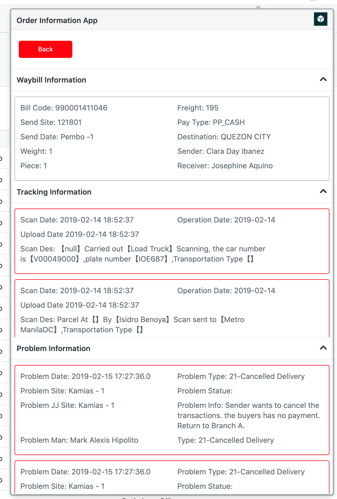

# Order Information App
## Table of Contents
- [Description](#description)
- [Installation Instructions](#installation-instructions)
- [Tools](#tools)
- [Useful Links](#useful-links)
- [Project Team](#project-team)
- [Support](#support)
- [Screenshots](#screenshots)

## Description

The Order Information app sits on the top bar. It displays the order information from J&T Express API.

## Installation Instructions

The following configuration can be used by running `zat server`
```
{
  "apiURL": "https://www.kuaididao.com/philippines-ifd-web/cs/order/track.do",
}
```

## Tools

The following tools were used to build this app:
- ZAF Framework v2
- Vue JS 2.6.0
- Zendesk Garden

## Useful Links

- [Technical Design Documentation](https://docs.google.com/document/d/1K2TIHA9yYN4QOc4Icbx-kiBtij-7ewq7rBB03DfVVpk/edit)

## Project Team

- Skip Moore (Development Services Manager)
- Damian Tan (Technical Architect)
- Anurag Singh (Engagement Manager)
- Ruth Anne Dilig (Web Developer)

## Screenshots


## Support

Please submit bug reports to support@zendesk.com